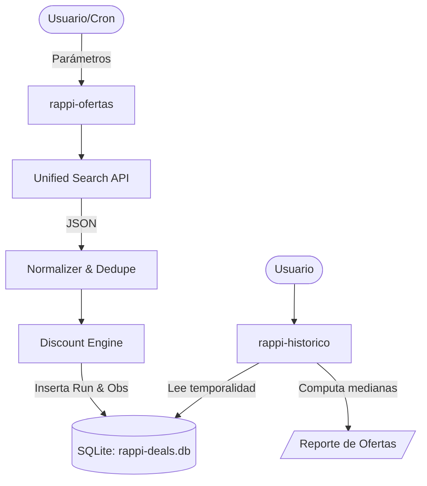

# Rappi Deal Hunter

> **Disclaimer Legal:** Proyecto independiente, experimental y no oficial. No afiliado con Rappi ni sus marcas subsidiarias. Esta herramienta NO efectúa compras, NO altera precios, NO evade mecanismos de autenticación y fue diseñada para consultas automatizadas de tráfico bajo (read-only). El usuario final es responsable de operar esta herramienta cumpliendo los términos de servicio, rate-limits y leyes aplicables.

## Descripción

**Rappi Deal Hunter** permite descubrir de manera autónoma tiendas, supermercados, farmacias y comercios disponibles por geolocalización, extrayendo su catálogo y estructurando promociones (como descuentos directos o NxM).

La herramienta cuenta con un módulo de **Análisis Histórico** que rastrea el precio real a través del tiempo y combate la manipulación de precios de lista (ej. inflar el precio original antes de aplicar un "descuento").

## Características Principales
- **Búsqueda Estructurada Autónoma:** Emplea el endpoint de `unified-search` para iterar mediante palabras clave adaptativas, extrayendo miles de artículos y superando barreras de catálogo oculto.
- **Motor de Ofertas Exactas:** Detecta verdaderas promociones resolviendo algebraicamente reglas como "Agregue 3, pague 2" vs. "Descuento directo", guardando siempre el `discount_effective`.
- **Evolución Histórica Constante:** Su base local SQLite (`runs` y `observations`) es un append-only de captura. 
- **Auditor Algorítmico:** `rappi-historico` expone la realidad estadística de cada artículo computando medianas a 7 y 30 días (`median_30d`), evidenciando verdaderos Minimums Históricos (`NEW_LOW`).

## Instalación & Quick Start (Termux / Linux)

```bash
git clone https://github.com/USERNAME/rappi-deal-hunter.git
cd rappi-deal-hunter
# Asegurar dependencias de Python 3 y SQLite3
chmod +x bin/rappi-ofertas bin/rappi-historico

# 1. Realiza tu primer barrido en una zona
./bin/rappi-ofertas --vertical supermercado --lat 19.4326 --lng -99.1332

# 2. Audita los descubrimientos y calcula la autenticidad de cada promoción
./bin/rappi-historico --top 50
```

## Arquitectura Resumida



## Limitaciones
* **Rate Limits Estrictos:** El rastreador detendrá los hilos proactivamente tras detectar códigos `429` o Cloudflare `1015` para no quemar tu IP.
* **Geolocalización:** El catálogo variará totalmente dependiendo de los parámetros de longitud/latitud que brindes.
* **Tiempo Biológico:** El análisis histórico requiere... historia. El primer día casi todos los productos aparecerán bajo `INSUFFICIENT_HISTORY`.

## Documentación Técnica
Revisa la documentación extendida en `/docs` para entender las fórmulas, los esquemas de base de datos y la arquitectura detallada:
- [Instalación](docs/installation-termux.md)
- [API Detectada](docs/api.md)
- [Motor de Descuentos](docs/discount-engine.md)
- [Modelo Histórico SQLite](docs/database.md)
- [Análisis y Clasificación de Ofertas](docs/historical-analysis.md)
- [Uso por Consola](docs/cli.md)
- [Historia del Descubrimiento Técnico](docs/research-history.md)
- [Troubleshooting](docs/troubleshooting.md)
