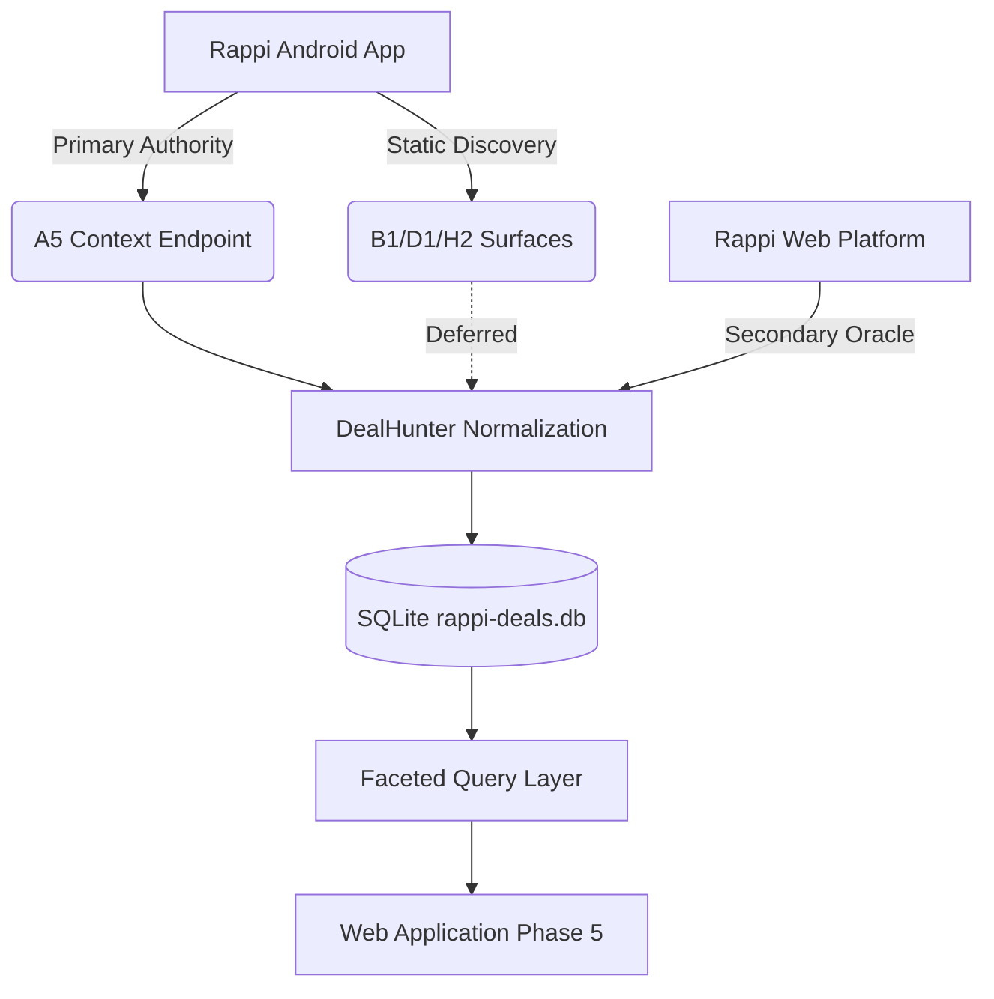
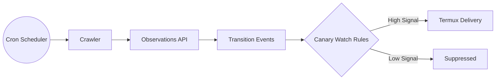
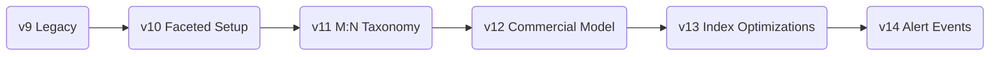

# DealHunter Architecture

## Provider Integration

```mermaid
graph TD
    A[Rappi Android App] -->|Primary Authority| B(A5 Context Endpoint)
    A -->|Static Discovery| C(B1/D1/H2 Surfaces)
    B --> D[DealHunter Normalization]
    C -.->|Deferred| D
    E[Rappi Web Platform] -->|Secondary Oracle| D
    D --> F[(SQLite rappi-deals.db)]
    F --> G[Faceted Query Layer]
    G --> H[Web Application Phase 5]
```

## Operational Pipeline

```mermaid
graph LR
    A((Cron Scheduler)) --> B[Crawler]
    B --> C[Observations API]
    C --> D[Transition Events]
    D --> E{Canary Watch Rules}
    E -->|High Signal| F[Termux Delivery]
    E -->|Low Signal| G[Suppressed]
```

## Schema Evolution

```mermaid
graph LR
    V9(v9 Legacy) --> V10(v10 Faceted Setup)
    V10 --> V11(v11 M:N Taxonomy)
    V11 --> V12(v12 Commercial Model)
    V12 --> V13(v13 Index Optimizations)
    V13 --> V14(v14 Alert Events)
```
