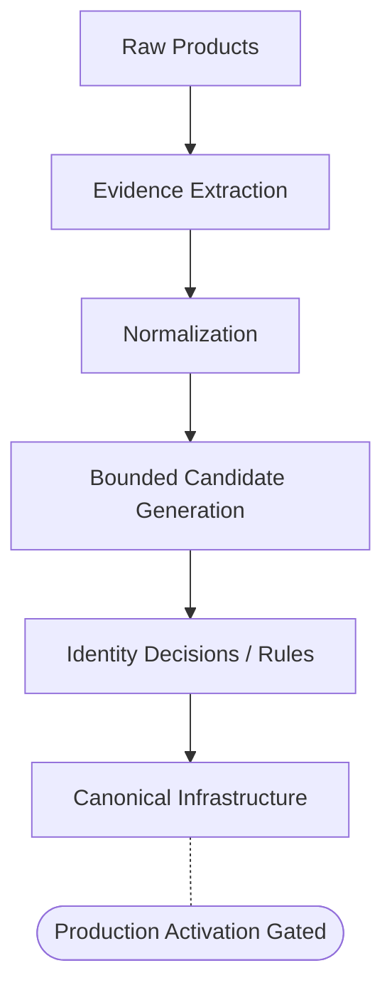
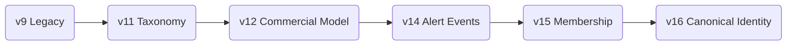

# DealHunter Architecture

## High-Level Architecture

```mermaid
graph TD
    A[Providers: Rappi, Uber Eats] -->|Discovery & Sync| B(Provider-aware Persistence)
    B --> C[(SQLite v16)]
    C --> D[Query / Eligibility / Score]
    D --> E[Web / Alerts / Watchlist]
```

## Identity Side Pipeline (Phase 5F Experimental)

```mermaid
graph TD
    A[Raw Products] --> B[Evidence Extraction]
    B --> C[Normalization]
    C --> D[Bounded Candidate Generation]
    D --> E[Identity Decisions / Rules]
    E --> F[Canonical Infrastructure]
    F -.- G([Production Activation Gated])
```

## Schema Evolution

```mermaid
graph LR
    V9(v9 Legacy) --> V11(v11 Taxonomy)
    V11 --> V12(v12 Commercial Model)
    V12 --> V14(v14 Alert Events)
    V14 --> V15(v15 Membership)
    V15 --> V16(v16 Canonical Identity)
```
