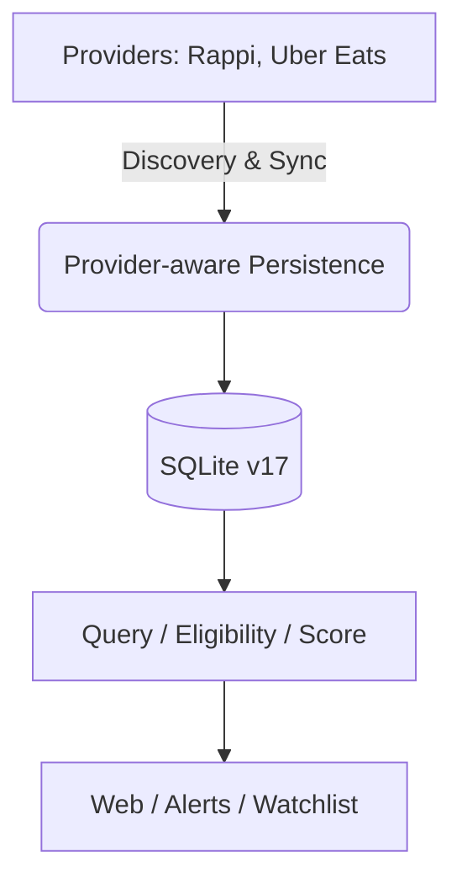
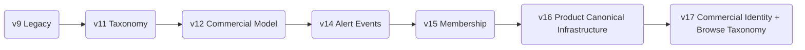

# DealHunter Architecture

## High-Level Architecture

Current RC boundary:

- Rappi and Uber Eats acquisition are production-capable.
- Raw identity is `(provider, store_id, product_id)`.
- Provider selection and Rappi Pro/Uber One eligibility are production configuration.
- Schema v17 is current. Raw provider identity remains authoritative even when a reviewed merchant/location mapping exists.
- `Provider Listing → Merchant → Location` is written only through explicit reviewed mapping; ambiguous listings remain `UNRESOLVED`.
- Raw provider taxonomy/path is preserved in `product_memberships`; only explicit reviewed `browse_mappings` classify it into `browse_nodes`; unmapped evidence remains `UNCLASSIFIED`.
- Product canonical matching remains shadow/experimental and cannot write memberships automatically.

## Identity Side Pipeline (Shadow / Experimental)

## Schema Evolution

## Authority boundaries

1. **Raw provider listing identity:** `(provider, store_id)` is never replaced.
2. **Merchant identity:** explicit reviewed mapping only.
3. **Location/outlet identity:** explicit reviewed mapping only and tied to a reviewed merchant.
4. **Browse classification:** explicit raw-taxonomy/path → browse-node mapping only.
5. **Product canonical identity:** separate shadow/experimental system; automatic canonicalization stays OFF.

Catalog ordering is also authoritative: Web exposes only sort modes implemented by the Query Layer. `savings` and `recent` use persisted price/timestamp evidence; unsupported catalog `opportunity` is not advertised.
