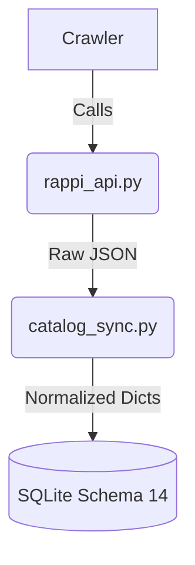
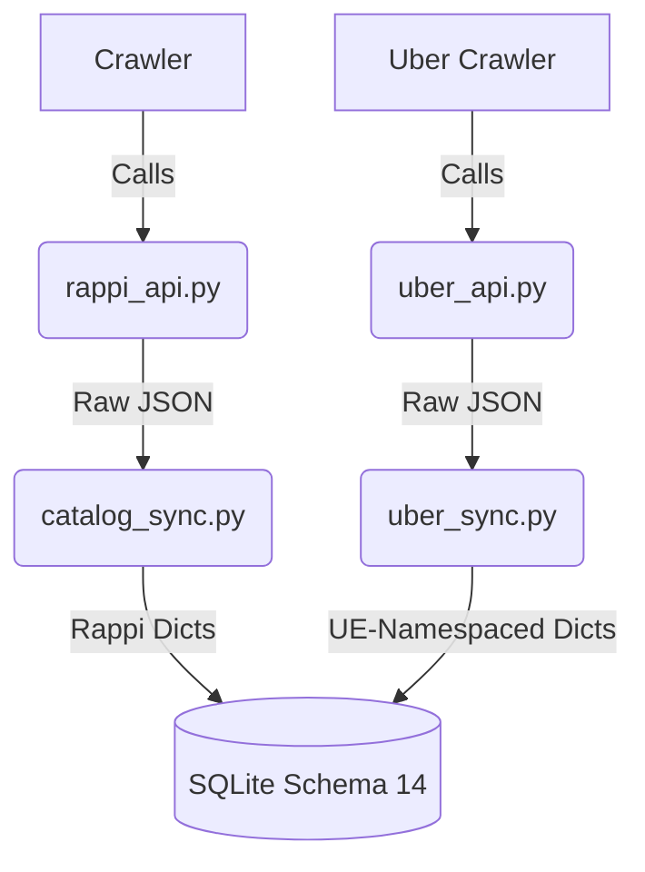

# UBER EATS INTEGRATION BLUEPRINT

## Strategies Evaluation

### A. Thin Acquisition Adapter (Namespaced Ingestion)
- **Concept**: Uber API calls are written alongside Rappi calls. Responses are mapped directly into DealHunter's existing dictionaries (`store`, `product`, `observation`) and dumped into SQLite Schema 14. Uber IDs are prefixed with `UE-`.
- **Complexity**: Low.
- **Migration Cost**: Zero.
- **Rappi Regression Risk**: Extremely Low. Rappi codebase remains untouched.
- **Testability**: High. We can mock `sync_uber_zone` without touching Rappi's tests.
- **Premature Abstraction Risk**: None.

### B. Explicit Provider Interface (Abstract Factory)
- **Concept**: Core engine refactored to use `BaseProvider`. `RappiProvider` and `UberProvider` inherit. 
- **Complexity**: High.
- **Migration Cost**: High. Requires rewriting `crawler.py`, adding `provider` column to DB, breaking Schema 14.
- **Rappi Regression Risk**: High. Refactoring the core engine affects the reference provider.
- **Premature Abstraction Risk**: Extreme. We don't know enough about Uber's API to design a generic `BaseProvider`.

### C. Provider Normalization Pipeline
- **Concept**: Raw Uber JSON dumped to SQLite. Asynchronous pipeline normalizes it to Schema 14.
- **Complexity**: Extreme.
- **Migration Cost**: Extreme.
- **Premature Abstraction Risk**: Extreme.

**Decision**: Strategy A (Thin Acquisition Adapter) is mandatory for Phase 5.

## What NOT To Generalize Yet
- Do **not** abstract `crawler.py` into a generic runner.
- Do **not** modify Schema 14.
- Do **not** build a universal `APIClient`. Let `uber_api.py` manage its own HTTP requests, headers, and rate limiting (Cloudflare/WAF).
- Do **not** rename `has_pro_offer` or `pro_price` in the DB. Treat them as `CONDITIONAL` conceptually at the presentation layer.

## Evidence Gathered from Uber Eats (Phase 5B Recon)
1. **Catalog Completeness**: [STILL_UNKNOWN] LIKELY COMPLETE via `getStoreV1`.
2. **Identity Format**: [CONFIRMED] UUID-like Base64 string.
3. **Pricing Model**: [STILL_UNKNOWN] Uber One impact requires auth.
4. **Auth Mechanism**: [CONFIRMED] Highly WAF blocked (Cloudflare), requires real session cookies.
5. **Rate Limiting**: [STILL_UNKNOWN] 429 threshold pending.

## Namespace Guidelines
- All Uber Eats Stores must be ingested as `store_id = "UE-xxxx"`.
- All Uber Eats Products must be ingested as `product_id = "UE-yyyy"`.
- Rappi IDs remain backwards compatible (no prefix required, or implicitly `RAPPI-`).

## Provisional Regression Contract
During implementation, the following tests MUST remain strictly green on `v3.0.1`:
1. All `test_web_*.py` and `test_semantic*.py`.
2. Existing Rappi `crawler` behavior must be unmodified.
3. No Schema migrations.
4. Quick Start must function for Rappi out-of-the-box.

## Diagrams

### CURRENT (Rappi Only)


### PROPOSED (Thin Acquisition Adapter)


### UNVALIDATED (Explicit Provider Interface - AVOID)
```mermaid
graph TD
    A[Core Engine] -->|discover()| B{BaseProvider}
    B --> C(RappiProvider)
    B --> D(UberProvider)
    C --> E[(SQLite Schema 15)]
    D --> E
```
