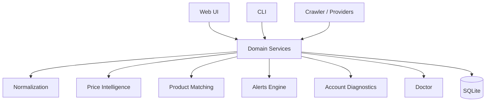
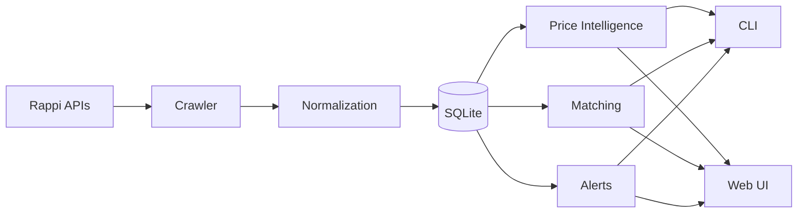
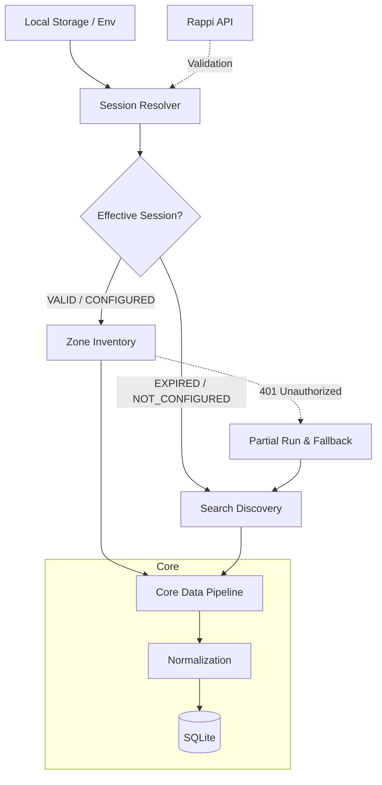

# Architecture

DealHunter sigue una arquitectura monolítica local orientada a servicios de dominio encapsulados, que pueden ser invocados tanto desde el CLI (`rappi-historico` / `rappi-ofertas`) como desde la Web UI.

## Data Flow

Todos los servicios acceden a una misma base de datos `SQLite`, minimizando dependencias externas y permitiendo portabilidad.

### Crawler Architecture & Session Flow

DealHunter implements a dual-mode crawling strategy routed by the **Session Resolver** which determines the **Effective Session**:

- **Session Resolver**: Unified single source of truth evaluating local session material (`SecretStore`) against network assertions.
- **Zone Inventory**: Uses authenticated endpoints to get full store catalogs in the active zone. Reconciles availability (STALE/UNAVAILABLE) *only* upon full completion.
- **Search Discovery**: Falls back to anonymous search queries to organically discover available deals. Does NOT perform destructive reconciliation.
- **Same Core**: Both crawlers utilize the exact same normalization, product mapping, filtering, and database ingestion core.
- **401 Fallback**: If a Zone Inventory run encounters an HTTP 401 mid-flight, the run is finalized as `PARTIAL` to prevent false deletion, and a new `SEARCH_DISCOVERY` run takes over automatically.
