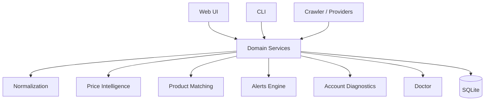
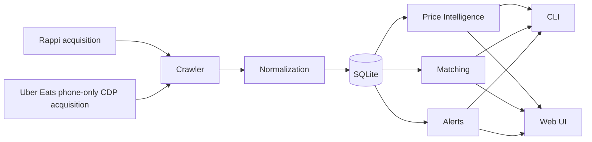
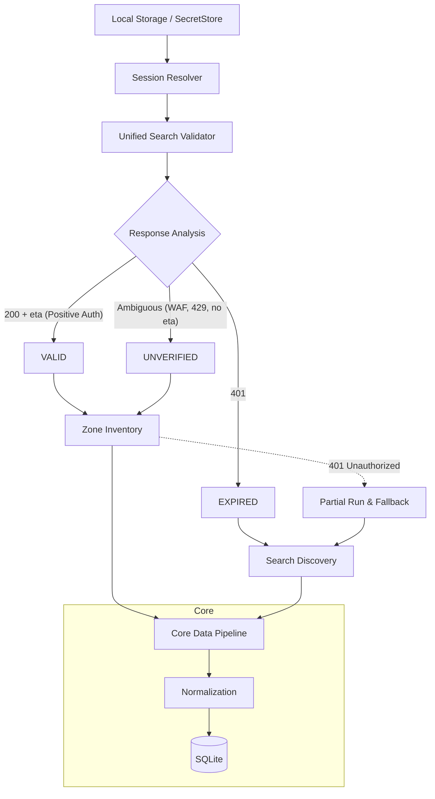

# Architecture

DealHunter sigue una arquitectura monolítica local orientada a servicios de dominio encapsulados, que pueden ser invocados tanto desde el CLI instalado (`dealhunter` / `rappi-ofertas`) como desde la Web UI.

## Data Flow

Todos los servicios acceden a una misma base de datos `SQLite`, minimizando dependencias externas y permitiendo portabilidad.

La identidad raw se conserva como `(provider, store_id, product_id)`. Schema v17 conserva esa identidad y añade fronteras explícitas de merchant/location y browse; la infraestructura canónica de producto introducida en v16 no reemplaza esa clave. La selección de
provider y la elegibilidad de Rappi Pro/Uber One se aplican después de identidad;
el matcher canónico continúa en shadow y no escribe memberships automáticamente.

Los runs normales de Uber usan Chromium headless nativo de Termux y CDP, sin PC
ni servidor X. Carbonyl se usa sólo para setup o renovación del perfil. El estado
de Uber tiene una única autoridad en `providers/uber_eats/status.py`: el diagnóstico
local no usa red y un profile existente permanece `UNVERIFIED`; la validación real
reutiliza el mismo `UberBrowserTransport.ensure_ready()` que consume el crawler.
Rappi mantiene de forma independiente `SessionService` / SecretStore.

### Crawler Architecture & Session Flow

DealHunter implements a dual-mode crawling strategy routed by the **Session Resolver** which determines the **Effective Session**:

- **Session Resolver**: Unified source of truth for local session material. A configured token can be attempted conservatively even when validation is `UNVERIFIED`; definitive 401 expires it and falls back.
- **Zone Inventory**: Uses authenticated endpoints to get full store catalogs in the active zone. Reconciles availability (STALE/UNAVAILABLE) *only* upon full completion.
- **Search Discovery**: Falls back to anonymous search queries to organically discover available deals. Does NOT perform destructive reconciliation.
- **Same Core**: Both crawlers utilize the exact same normalization, product mapping, filtering, and database ingestion core.
- **401 Fallback**: If a Zone Inventory run encounters an HTTP 401 mid-flight, the run is finalized as `PARTIAL` to prevent false deletion, and a new `SEARCH_DISCOVERY` run takes over automatically.

## Authority boundaries

1. **Raw listing**: `(provider, store_id)` nunca se sustituye por un nombre visible.
2. **Merchant/location**: sólo mappings explícitamente revisados; lo ambiguo permanece `UNRESOLVED`.
3. **Browse taxonomy**: mappings explícitos desde evidencia raw; sin mapping = `UNCLASSIFIED`.
4. **Product canonical identity**: pipeline separado, shadow/experimental; automatic membership writes OFF.
5. **SQLite**: `src/dealhunter/db.py` es autoridad del schema; Web/CLI usan conexiones acotadas y migraciones atómicas.
