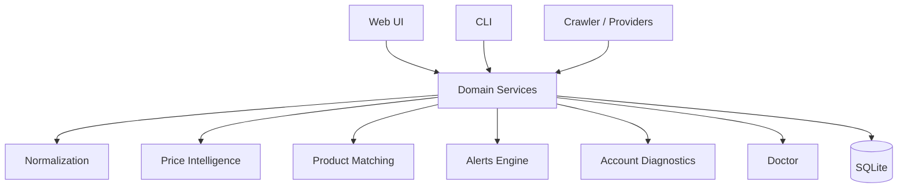
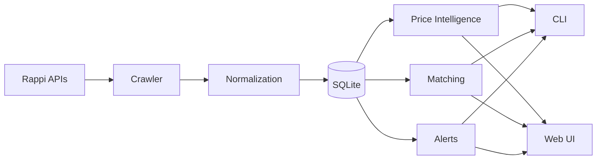
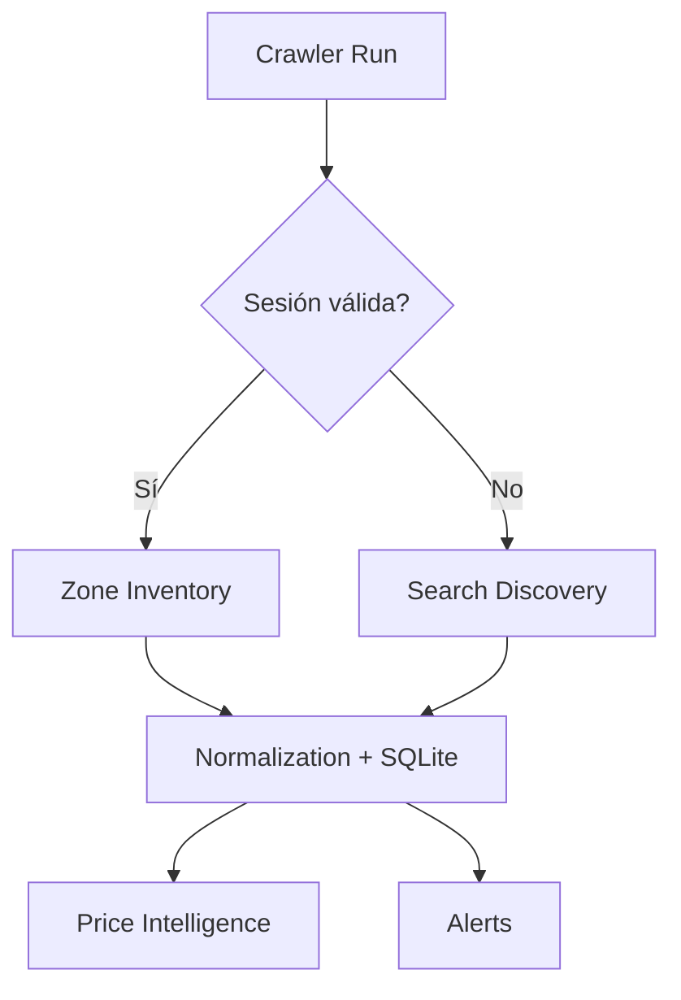

# Architecture

DealHunter sigue una arquitectura monolítica local orientada a servicios de dominio encapsulados, que pueden ser invocados tanto desde el CLI (`rappi-historico` / `rappi-ofertas`) como desde la Web UI.

## Data Flow

Todos los servicios acceden a una misma base de datos `SQLite`, minimizando dependencias externas y permitiendo portabilidad.

### Crawler Fallback Architecture

DealHunter dynamically chooses its strategy based on the availability of a valid session:

- **SESSION VALID -> Zone Inventory**: Uses authenticated endpoints to get full store catalogs in the active zone.
- **SESSION UNAVAILABLE -> Search Discovery**: Falls back to anonymous search queries to discover available deals.
