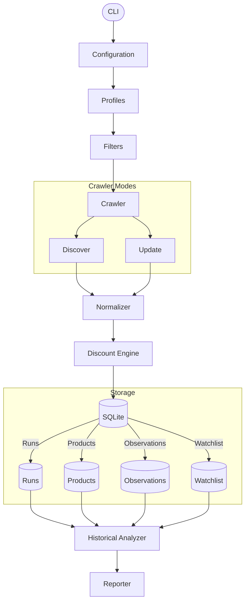

# Arquitectura General

```mermaid
flowchart TD
    CLI([CLI]) --> CFG[Configuration]
    CFG --> PRF[Profiles]
    PRF --> FLT[Filters]
    FLT --> CR[Crawler]

    subgraph Crawler Modes
        CR --> D[Discover]
        CR --> U[Update]
    end
    
    D --> NM[Normalizer]
    U --> NM
    
    NM --> DE[Discount Engine]
    
    DE --> DB[(SQLite)]
    
    subgraph Storage
        DB -->|Runs| TB1[(Runs)]
        DB -->|Products| TB2[(Products)]
        DB -->|Observations| TB3[(Observations)]
        DB -->|Watchlist| TB4[(Watchlist)]
    end
    
    TB1 --> HA[Historical Analyzer]
    TB2 --> HA
    TB3 --> HA
    TB4 --> HA
    
    HA --> REP[Reporter]
```
