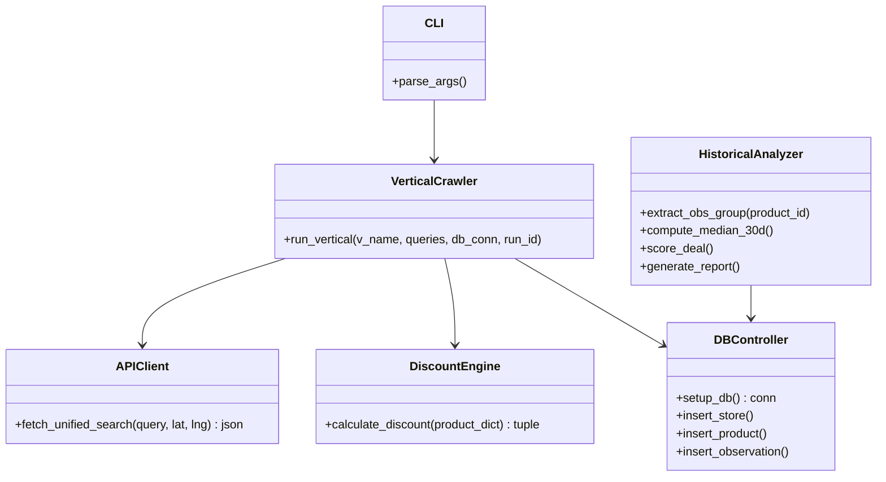

# Componentes de Sistema (Modulo)

*Nota: La arquitectura funcional del código se representa en diagrama de clase para ilustrar el encapsulamiento a nivel de responsabilidades.*

```mermaid
classDiagram
    class CLI {
        +parse_args()
    }

    class APIClient {
        +fetch_unified_search(query, lat, lng) json
    }

    class DiscountEngine {
        +calculate_discount(product_dict) tuple
    }

    class DBController {
        +setup_db() conn
        +insert_store()
        +insert_product()
        +insert_observation()
    }

    class VerticalCrawler {
        +run_vertical(v_name, queries, db_conn, run_id)
    }

    class HistoricalAnalyzer {
        +extract_obs_group(product_id)
        +compute_median_30d()
        +score_deal()
        +generate_report()
    }

    CLI --> VerticalCrawler
    VerticalCrawler --> APIClient
    VerticalCrawler --> DiscountEngine
    VerticalCrawler --> DBController
    HistoricalAnalyzer --> DBController
```
