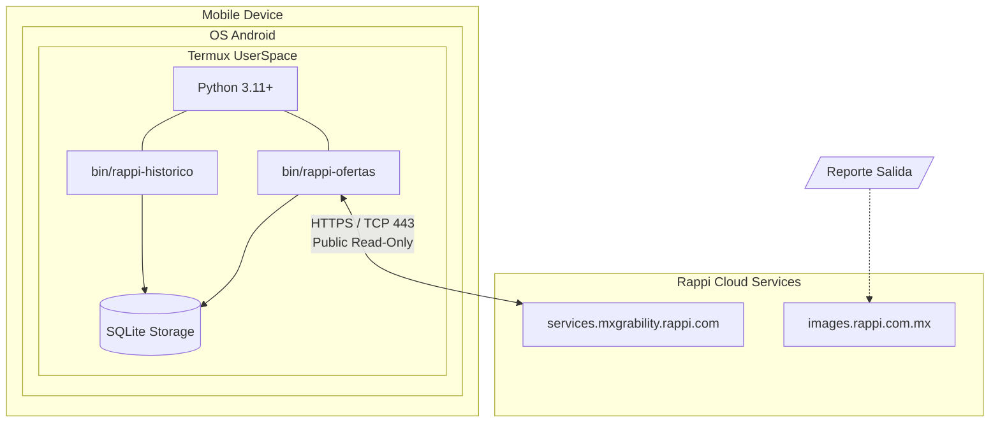

# Diagrama de Despliegue

```mermaid
flowchart TD
    subgraph Mobile Device
        subgraph OS Android
            subgraph Termux UserSpace
                Py[Python 3.11+]
                DB[(SQLite Storage)]
                
                Py --- RO[bin/rappi-ofertas]
                Py --- RH[bin/rappi-historico]
                
                RO --> DB
                RH --> DB
            end
        end
    end

    subgraph Rappi Cloud Services
        API[services.mxgrability.rappi.com]
        CDN[images.rappi.com.mx]
    end

    RO <-->|HTTPS / TCP 443 \n Public Read-Only| API
    OUT[/Reporte Salida/] -.-> CDN
```
