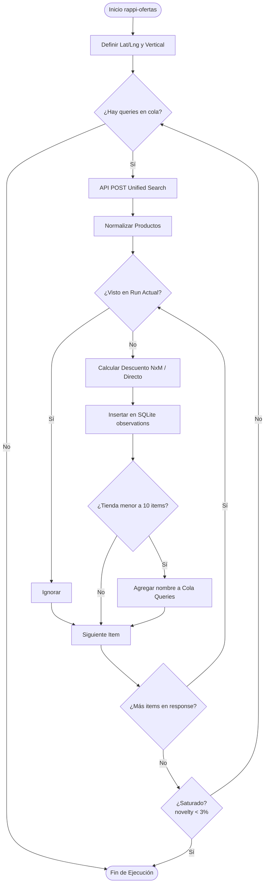

# Flujo de Actividades (Activity Diagram)

```mermaid
flowchart TD
    Start([Inicio rappi-ofertas]) --> SetLoc[Definir Lat/Lng y Vertical]
    SetLoc --> NextQuery{¿Hay queries en cola?}
    
    NextQuery -- Sí --> Req[API POST Unified Search]
    NextQuery -- No --> Finish([Fin de Ejecución])

    Req --> Normaliza[Normalizar Productos]
    
    Normaliza --> Dedupe{¿Visto en Run Actual?}
    Dedupe -- Sí --> Skip[Ignorar]
    Dedupe -- No --> Math[Calcular Descuento NxM / Directo]
    
    Skip --> NextItem
    Math --> InsertDB[Insertar en SQLite observations]
    InsertDB --> NewKey{¿Tienda menor a 10 items?}
    
    NewKey -- Sí --> QAdd[Agregar nombre a Cola Queries]
    NewKey -- No --> NextItem[Siguiente Item]
    
    QAdd --> NextItem
    
    NextItem --> HasMore{¿Más items en response?}
    HasMore -- Sí --> Dedupe
    HasMore -- No --> CheckSat{¿Saturado? \n novelty < 3%}
    
    CheckSat -- Sí --> Finish
    CheckSat -- No --> NextQuery
```
