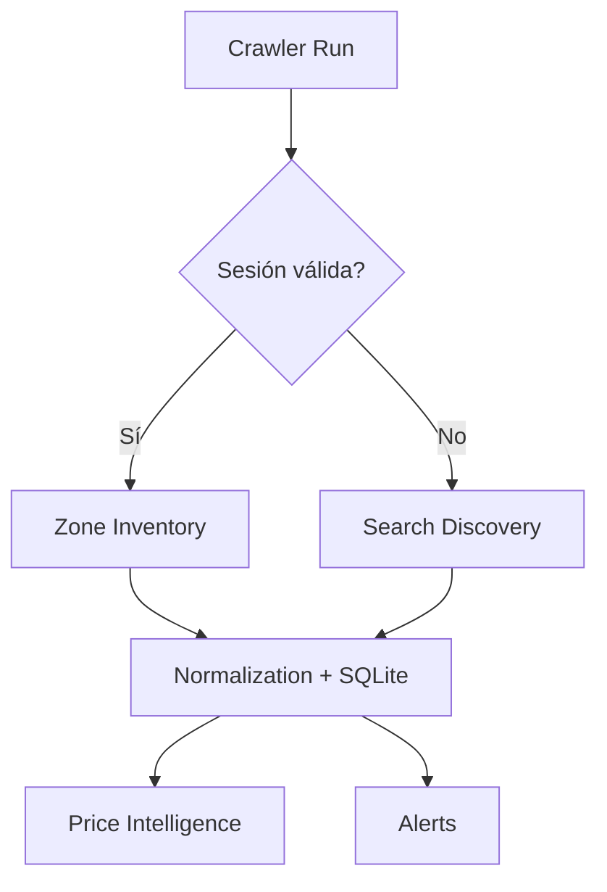

# Web Catalog Sync

The web interface for Catalog Sync is available at `/admin/catalog-sync`. It provides a UI to configure sessions (Temporary or Persistent), view status, and trigger synchronizations. Secure POST requests with CSRF tokens are used to update settings.

### Crawler Fallback Architecture

DealHunter dynamically chooses its strategy based on the availability of a valid session:

- **SESSION VALID -> Zone Inventory**: Uses authenticated endpoints to get full store catalogs in the active zone.
- **SESSION UNAVAILABLE -> Search Discovery**: Falls back to anonymous search queries to discover available deals.

## Web UX

- **Con sesión válida:** Muestra `✅ Inventario de zona activo`.
- **Sin sesión:** Muestra `⚠ Cobertura limitada` y un botón `[Configurar sesión]`. DealHunter continúa mediante búsquedas.
- **Sesión expirada:** Muestra `⚠ Tu sesión Rappi expiró.` con botón `[Actualizar sesión]`.

Ruta de operación: Administrar -> Catalog Sync -> Configurar sesión -> Comprobar -> Sincronizar.
