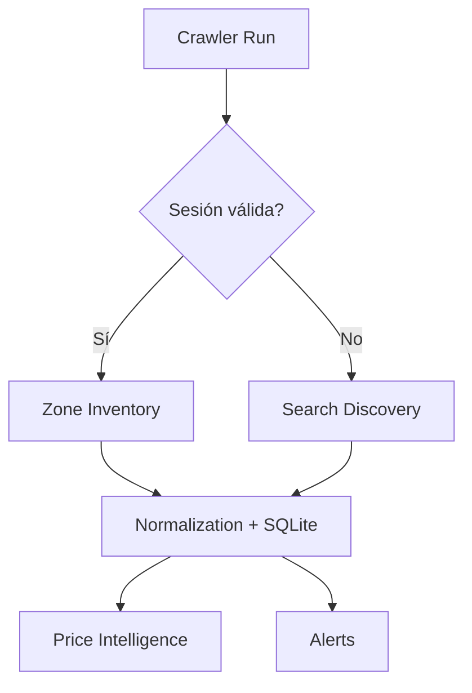

# Catalog Sync

Catalog Sync allows DealHunter to pull structural data (categories, products) from authenticated providers using a provided session token. Currently supported verticals include Market and Turbo. It allows persistent storage of credentials (opt-in) using SecretStore.

### Crawler Fallback Architecture

DealHunter dynamically chooses its strategy based on the availability of a valid session:

- **SESSION VALID -> Zone Inventory**: Uses authenticated endpoints to get full store catalogs in the active zone.
- **SESSION UNAVAILABLE -> Search Discovery**: Falls back to anonymous search queries to discover available deals.
