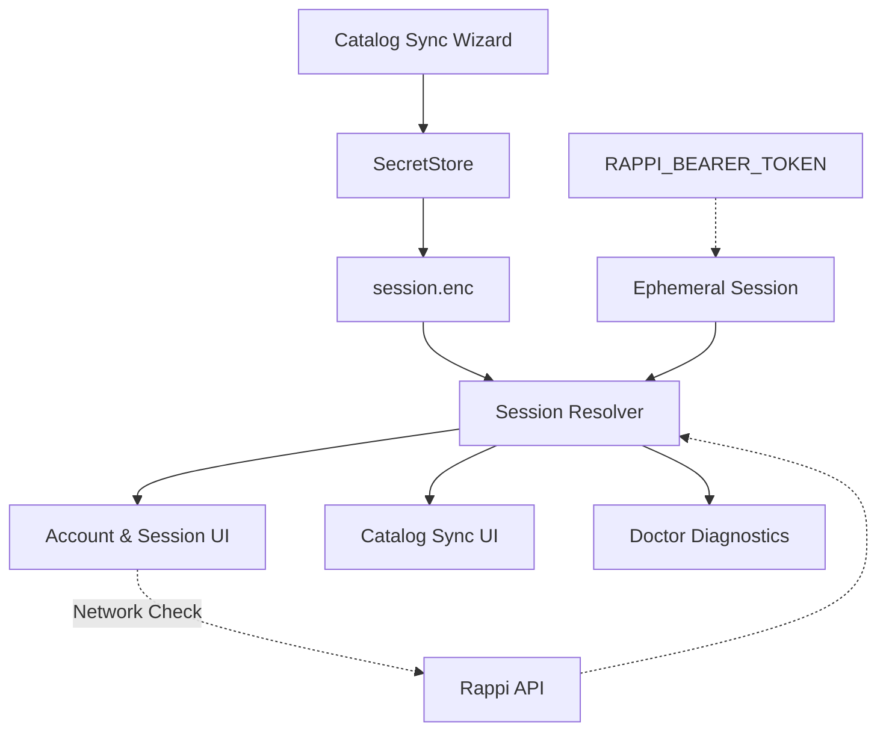
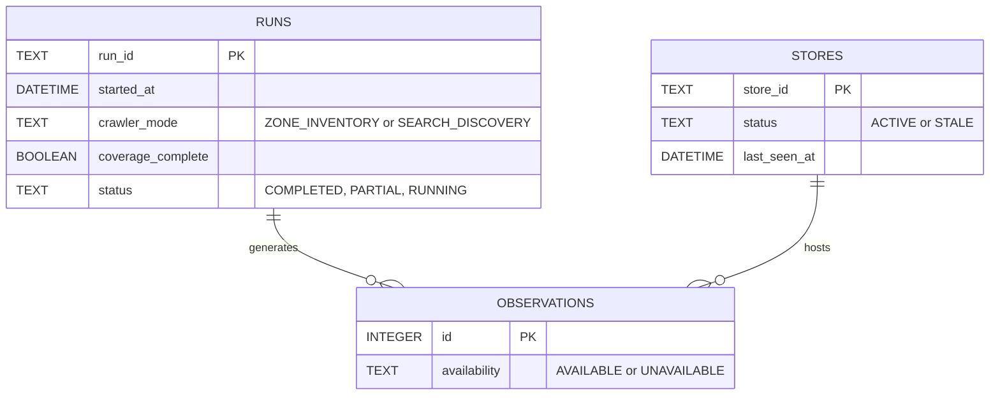

# Catalog Sync

Catalog Sync allows DealHunter to pull structural data (categories, products) from authenticated providers using a provided session token. Currently supported verticals include Market and Turbo. It allows persistent storage of credentials (opt-in) using SecretStore.

### Admin / Session Flow

### Schema & Metadata Updates

To support Zone Inventory routing and validation, the DealHunter SQLite Schema (v8) tracks:

- **coverage_complete**: True only when `ZONE_INVENTORY` successfully retrieves all catalogs without partial errors.
- **crawler_mode**: Tracks the specific crawler strategy used for a run.
- **stores.status / stores.last_seen_at**: Tracks availability reconciliation across Zone Inventory runs.
## Zone Inventory

Zone Inventory mantiene una representación local del inventario observable para la **sesión actual**, **zona actual** y **momento actual**. No extrae "todo Rappi", sino todo el inventario expuesto por el proveedor para tu ubicación.

### Crawler Modes

| Sesión | Modo |
| --- | --- |
| VALID | ZONE_INVENTORY |
| NOT_CONFIGURED | SEARCH_DISCOVERY |
| EXPIRED | SEARCH_DISCOVERY |
| INVALID | SEARCH_DISCOVERY |

- **ZONE_INVENTORY**: Requiere sesión válida. Descubre tiendas, obtiene catálogos soportados y reconcilia entidades. Mayor cobertura.
- **SEARCH_DISCOVERY**: Funciona sin sesión mediante búsquedas en el buscador. Cobertura limitada (fallback automático).

### Regla Canónica de Reconciliación

> "Absence of evidence is not evidence of removal."
> (La ausencia de evidencia no implica que una tienda o producto haya desaparecido.)

Sólo un alcance *completamente verificado* (`coverage_complete=1`) modifica estados por ausencia. 

- **Stores**: Si un discovery ZONE se completa y una tienda antes vista está ausente, se marca como `STALE`.
- **Products**: Si el catálogo de una tienda es descargado exitosamente, y un producto conocido no figura, se marca como `UNAVAILABLE`. (Si más adelante reaparece, Alerts Engine disparará `BACK_IN_STOCK`).

Si ocurre un 401, timeout, 429 o fallo parcial, el run se etiqueta como `PARTIAL` y **no se realiza reconciliación destructiva**.

### Fallback 401
Si ZONE_INVENTORY inicia y en medio del proceso recibe un HTTP 401, el run aborta, se guarda como PARTIAL, y se inicia un run SEARCH_DISCOVERY con metadata separada e inequívoca.

### Limitations
- Supermercados/Farmacias (Market/Turbo) están totalmente soportados.
- Restaurants están limitados (categorías agregadas, parseo heterogéneo).
- Sujeto a provider layout changes, timeout y request budgets.

## Semantic State Constraints

1. **Session Lifecycle**:
   - `NOT_CONFIGURED`: No token.
   - `CONFIGURED`: Token exists locally (e.g., in `session.enc`), but its validity is `UNVERIFIED`.
   - `VALID`: Token successfully verified. If the profile API gets a WAF 403, we fall back to a dummy search. An HTTP 400 (Bad Request due to payload) or 200 proves authenticity.
   - `EXPIRED`: Only a true `HTTP 401 Unauthorized` destroys the session and marks it expired. Timeouts or 429s result in `CONFIGURED (Unverified)`.

2. **Zone Inventory Lifecycle**:
   - `READY`: The session is `VALID` but no inventory has been run.
   - `SYNCHRONIZED (ACTIVE)`: The last run had `crawler_mode = ZONE_INVENTORY`, `status = COMPLETED`, and `coverage_complete = 1`.
   - `PARTIAL`: The last run had `coverage_complete = 0` or status `PARTIAL`.
   - `SEARCH DISCOVERY`: Fallback mode when session is missing or expired.
