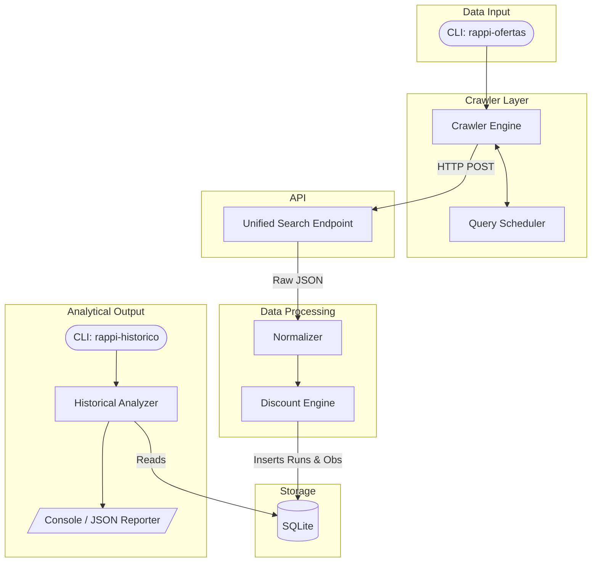

# Arquitectura General

```mermaid
flowchart TD
    subgraph Data Input
        CLI([CLI: rappi-ofertas])
    end

    subgraph Crawler Layer
        CR[Crawler Engine]
        QS[Query Scheduler]
        CR <--> QS
    end

    subgraph API
        US[Unified Search Endpoint]
    end

    subgraph Data Processing
        NM[Normalizer]
        DE[Discount Engine]
    end

    subgraph Storage
        DB[(SQLite)]
    end

    subgraph Analytical Output
        CLI2([CLI: rappi-historico])
        HA[Historical Analyzer]
        OUT[/Console / JSON Reporter/]
    end

    CLI --> CR
    CR -->|HTTP POST| US
    US -->|Raw JSON| NM
    NM --> DE
    DE -->|Inserts Runs & Obs| DB

    CLI2 --> HA
    HA -->|Reads| DB
    HA --> OUT
```
