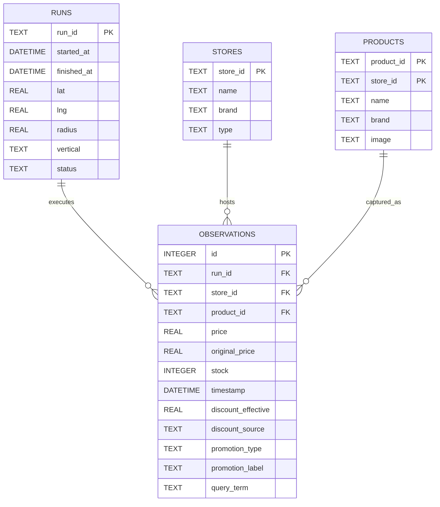

# Diagrama de Entidad Relación (SQLite)

```mermaid
erDiagram
    RUNS ||--o{ OBSERVATIONS : executes
    STORES ||--o{ OBSERVATIONS : hosts
    PRODUCTS ||--o{ OBSERVATIONS : captured_as
    
    RUNS {
        TEXT run_id PK
        DATETIME started_at
        DATETIME finished_at
        REAL lat
        REAL lng
        REAL radius
        TEXT vertical
        TEXT status
    }

    STORES {
        TEXT store_id PK
        TEXT name
        TEXT brand
        TEXT type
    }

    PRODUCTS {
        TEXT product_id PK
        TEXT store_id PK
        TEXT name
        TEXT brand
        TEXT image
    }

    OBSERVATIONS {
        INTEGER id PK
        TEXT run_id FK
        TEXT store_id FK
        TEXT product_id FK
        REAL price
        REAL original_price
        INTEGER stock
        DATETIME timestamp
        REAL discount_effective
        TEXT discount_source
        TEXT promotion_type
        TEXT promotion_label
        TEXT query_term
    }
```
