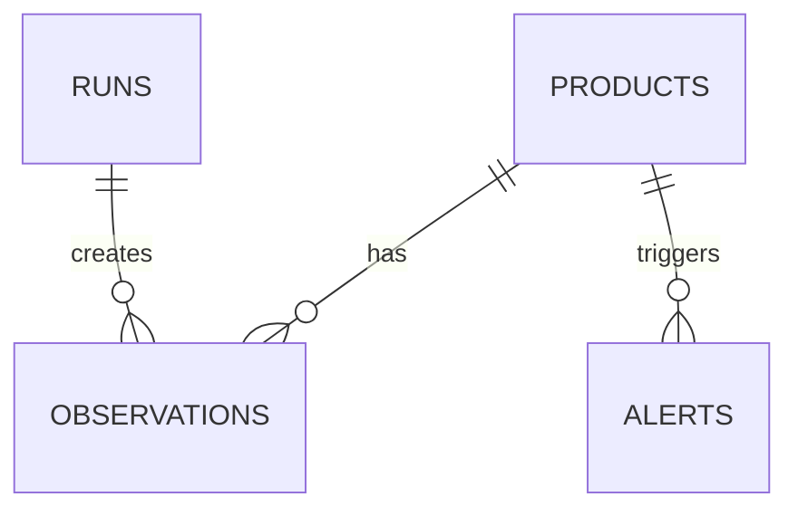

# History and Observations

El modelo de datos separa las representaciones de catálogo de los registros temporales empíricos.

- **Productos (`products`)**: Entidad relativamente estable con metadata semántica.
- **Ejecuciones (`runs`)**: Una ejecución temporal que agrupa datos de escaneo, incluyendo métricas y finalización.
- **Observaciones (`observations`)**: El estado empírico del precio y disponibilidad en un instante exacto de tiempo, ligado a un `run_id`.
- **Alertas (`alerts`)**: Eventos resultantes de evaluar observaciones mediante el Alerts Engine.

Se realiza deduplicación temporal basándose en la clave compuesta `(run_id, store_id, product_id)`.
