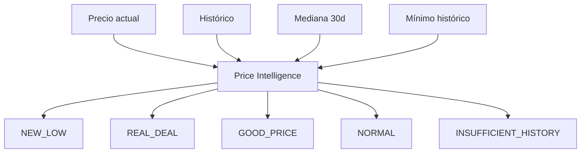

# Price Intelligence

El motor de **Price Intelligence** combate la manipulación de "precios originales" evaluando precios actuales contra el histórico empírico del producto en la misma tienda.

## Estados Documentados

- `INSUFFICIENT_HISTORY`: Menos de 3 observaciones o < 1 día de historial.
- `NEW_LOW`: Precio actual es inferior al mínimo histórico anterior.
- `REAL_DEAL`: Precio actual es ≥ 15% inferior a la mediana móvil de los últimos 30 días.
- `GOOD_PRICE`: Precio actual es ≥ 5% (pero < 15%) inferior a la mediana de 30 días.
- `NORMAL`: No presenta ventaja histórica demostrable.

### Indicadores Flag

DealHunter reporta advertencias adosadas al estado principal.
- `SUSPICIOUS_REFERENCE_PRICE`: Se levanta si el "precio original" anunciado por el supermercado supera ampliamente el máximo histórico registrado para ese producto, sugiriendo inflación artificial.

## Descuentos

Los descuentos se normalizan usando fórmulas comprobables:
- **Descuento directo**: `(1 - price / original_price) * 100`
- **Promociones NxM**: `(1 - units_condition / promotion_value) * 100` (Ej. `2x1` = 50%, `3x2` = 33.33%)

El core nunca suma descuentos incompatibles y presenta el `effective_discount` priorizado.
