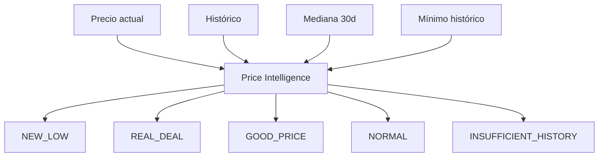

# Price Intelligence

El motor de **Price Intelligence** combate la manipulación de "precios originales" evaluando precios actuales contra el histórico empírico del producto en la misma tienda.

## Estados Documentados

- `INSUFFICIENT_HISTORY`: Menos de 3 observaciones o < 1 día de historial.
- `NEW_LOW`: Precio actual es inferior al mínimo histórico anterior.
- `REAL_DEAL`: Precio actual es ≥ 15% inferior a la mediana móvil de los últimos 30 días.
- `GOOD_PRICE`: Precio actual es ≥ 5% (pero < 15%) inferior a la mediana de 30 días.
- `NORMAL`: No presenta ventaja histórica demostrable.

### Indicadores Flag

DealHunter reporta advertencias adosadas al estado principal.
- `SUSPICIOUS_REFERENCE_PRICE`: Se levanta si el "precio original" anunciado por el supermercado supera ampliamente el máximo histórico registrado para ese producto, sugiriendo inflación artificial.

## Descuentos

Los descuentos se normalizan usando fórmulas comprobables:
- **Descuento directo**: `(1 - price / original_price) * 100`
- **Promociones NxM**: `(1 - units_condition / promotion_value) * 100` (Ej. `2x1` = 50%, `3x2` = 33.33%)

El core nunca suma descuentos incompatibles y presenta el `effective_discount` priorizado.

## Price Integrity Contract

DealHunter almacena estrictamente lo que Rappi cobra. Si existe un precio final explícito que concuerda con la metadata (con un margen mínimo de redondeo), se utiliza como fuente de verdad. Si existe discrepancia severa (ej. glitch de divisas devolviendo USD en lugar de MXN), DealHunter reconstruye el precio base usando el descuento oficial (`discount` fraccional + `real_price`). Nunca se mezclan monedas o entidades incompatibles.

## Deal Score y Confidence

Para ordenar las oportunidades globales sin depender solo del porcentaje de descuento, DealHunter implementa **Deal Score V1**:
- **Deal Quality**: Evalúa el impacto económico (descuento base, promociones NxM), la ventaja de mercado (comparación entre tiendas) y bonos por eventos (NEW_LOW).
- **Confidence**: Mide la fiabilidad del histórico (número de observaciones y antigüedad).
- **Deal Score Total**: Pondera el *Deal Quality* según la *Confidence*. Un puntaje alto garantiza que el descuento es sobresaliente y el histórico lo respalda sólidamente.
