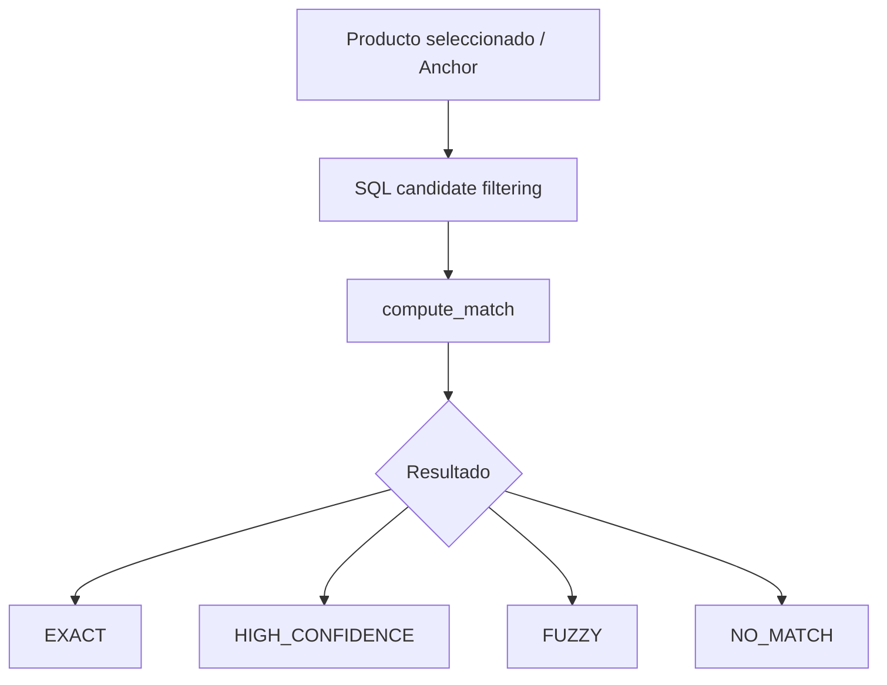

# Product Matching

El proceso de comparación cruzada entre tiendas para identificar si dos productos son el mismo, incluso si los textos del proveedor varían ligeramente.

## Anchor Matching

El pipeline prefiere una aproximación **precision-first**: es preferible omitir un falso negativo que sugerir un falso positivo de productos diferentes.

1. **SQL Candidate Filtering**: Filtra usando palabras clave base para limitar la carga de procesamiento en Python (generalmente a un LIMIT). **SQL reduce candidatos pero NO decide equivalencia.**
2. **Matcher Engine (`compute_match`)**: Cruza la metadata normalizada, marcas, fingerprints y cantidades, y devuelve una de las clases de confianza: `EXACT`, `HIGH_CONFIDENCE`, `FUZZY` o `NO_MATCH`.

## Best Store
Definido como "la tienda con el menor `current_price` entre equivalentes válidos en el momento de la consulta". No debe confundirse con el "precio mínimo histórico" (que es el menor valor temporal del producto, sin importar qué tienda lo tuvo).
