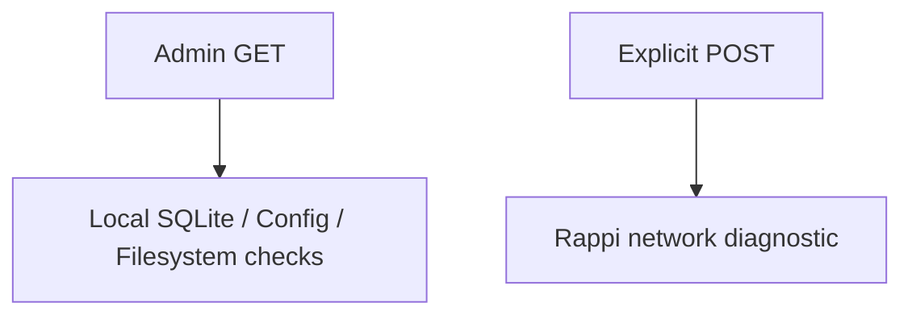

# Admin Interface

La interfaz web de Administración permite diagnosticar, respaldar y auditar la operación de DealHunter.

## Privacidad y Red (Network Audit)
Al navegar por **cualquier** página `GET` de Admin, se producen `0 external requests`. La navegación local es estricta.

## Cuenta (Account Security)
- El token de la cuenta (`RAPPI_BEARER_TOKEN`) reside de manera **efímera** en variables de entorno (environment only).
- No existe persistencia, logs, SQLite dumps o config text para este secreto.
- La UI jamás expone el token (ni parcial ni ofuscado), sólo su estatus (`CONFIGURED` o `NOT_CONFIGURED`).
- La validación contra los servidores del proveedor es estrictamente opt-in mediante POST.

## Actividad y Eventos (Runs / Events)
- **Runs**: Paginación de ejecuciones, con estados `COMPLETED`, `PARTIAL`, `FAILED`. El Detalle preserva la privacidad ignorando `lat`/`lng` de los checkpoints.
- **Events**: Se generan estructurados parseando el payload de la columna `vertical` de los `runs` parciales o fallidos. **No se introducen nuevas tablas redundantes**.

## Doctor
- Check estático sin red en GET.
- Action explícita POST respetando topes como Cloudflare limits o HTTP 429. **No hay evasión agresiva de rate-limits**.

## Base de Datos
Acciones limitadas por UI a:
- **Integrity Check**
- **Create Backup** (Función `backup_db()` interna, no susceptible a *path traversal* o inyecciones arbitrarias).
- Ausencia intencional de: DROP, DELETE, arbitrary SQL o VACUUM vía web.

## Configuración (Settings)
Muestra visualmente la precedencia de los ajustes:
`CLI > Profile > Global (config.toml) > Default`

Diferencia el valor efectivo del valor guardado y aplica una lista estricta (`allowlist`) de configuración categorizada en:
- `SAFE_EDITABLE`
- `READ_ONLY`
- `SECRET_FORBIDDEN` (Token jamas es enviado en HTML, UI recibe solo un boolean).
- **Background Runtime**: Inspección de `termux-wake-lock` para evitar que Android ponga en pausa el servidor web.
